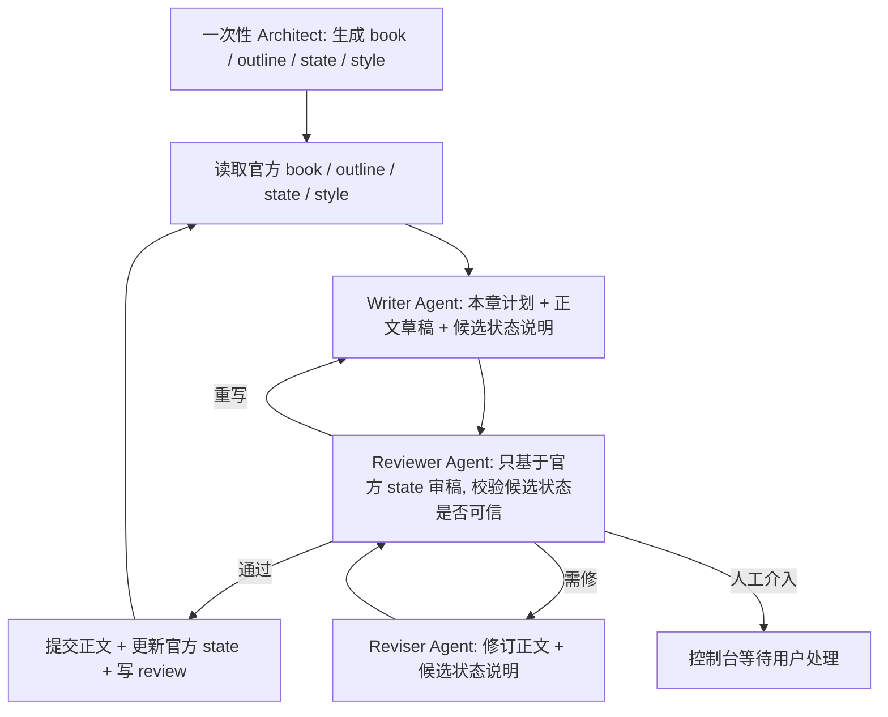

# InkOS Next 核心能力提炼方案（评审稿）

日期：2026-04-25  
状态：规划评审稿，不代表当前 InkOS 已实现  
目标：从现有 InkOS 中提炼核心写作能力，规划一个更简单、更稳定的新项目

## 1. 一句话定位

InkOS Next 是一个面向长篇网文的自动写作控制台：用户给出书籍方向，系统通过多 Agent 闭环逐章生成、审稿、修订、沉淀记忆，并尽量把“能不能过稿”的判断交给稳定的编辑型 Agent，而不是堆复杂代码规则。

核心取舍：

- 保留 InkOS 最有价值的提示词资产：写作铁律、去 AI 味方法、审稿维度、状态结算原则、修稿原则。
- 放弃当前 InkOS 过重的文件拆分和流水线分支。
- 新项目优先做“少文件、强闭环、可观察、可人工干预”。
- 简单网页控制台优先于复杂 CLI 生态。

## 2. 核心能力

### 2.1 自动化逐章生成高质量网文小说

系统应支持：

1. 从书籍基础设定开始，自动写下一章。
2. 每章生成后自动审稿。
3. 审稿不通过时自动修订或重写。
4. 通过后自动更新书籍状态和伏笔。
5. 可以连续循环生成多章。

成功标准不是“能产出文字”，而是：

- 章节承接上文，不跳状态。
- 角色动机、信息边界、关系变化自洽。
- 每章有冲突、推进和读者继续读的理由。
- 文风不明显模板化，不出现高频 AI 痕迹。
- 伏笔能推进或回收，不能无限堆积。

### 2.2 简单网页控制台

控制台只承担用户真正需要干预的部分：

- 创建书籍
- 编辑核心设定
- 启动 / 暂停自动写作
- 查看当前章节状态
- 查看审稿意见和修订记录
- 人工通过、驳回或要求重写
- 查看提示词包
- 查看运行日志和 AI 原文日志

第一版不追求复杂数据看板。页面少、路径短、状态清晰更重要。

### 2.3 多 Agent 架构

多 Agent 的目标不是“看起来智能”，而是把真正不同的判断分开。新项目不再把 Planner、Writer、Memory 拆成三个运行时 Agent；这三件事可以合并进 Writer Agent，因为它们本质上都服务于“这一章应该怎么写、写成什么、写完后状态会怎样”。

核心架构改为：

1. Architect Agent：一次性建书。
2. Writer Agent：每章负责计划、正文、候选状态说明。
3. Reviewer Agent：负责审稿和最终放行判断。
4. Reviser Agent：负责按审稿意见修稿。

核心 Agent：

| Agent | 主要职责 | 不负责 |
|---|---|---|
| Architect Agent | 初始化书籍基底，产出世界观、人物、主线、规则、文风约束 | 不逐章写正文 |
| Writer Agent | 读取 `book/outline/state/style`，内部完成本章计划、正文写作、候选状态变化说明 | 不判断自己是否过稿，不写入官方 `state.md` |
| Reviewer Agent | 按审稿维度判断是否通过，给出证据、修改方向和最终动作 | 不直接改正文，不把候选状态当成官方事实 |
| Reviser Agent | 根据审稿意见修正文稿，并同步给出修订后的候选状态变化说明 | 不改变核心剧情方向，除非 Reviewer 明确要求重写 |

MVP 只需要 3 个运行时 Agent：

- Writer（合并 Planner + Writer + Memory）
- Reviewer（合并审稿 + 最终过稿判断）
- Reviser

Architect 只在建书或重大重构时调用。后续如果 Reviewer 的判断仍不稳定，再考虑拆出独立 Chief Editor；第一版不主动增加这个复杂度。

### 2.4 用工作流循环替代复杂文件构造

当前 InkOS 有较多 truth files、snapshot、review staging、runtime state。新项目建议先压缩为少量“人和 Agent 都能读懂”的文件。

推荐项目结构：

```text
workspace/
  books/
    {bookId}/
      book.md
      outline.md
      state.md
      style.md
      manifest.json
      chapters/
        0001.md
        0002.md
      reviews/
        0001.md
        0002.md
      runs/
        20260425-101500.jsonl
```

文件职责：

| 文件 | 用途 | 说明 |
|---|---|---|
| `book.md` | 书籍基底 | 题材、卖点、世界观、主角、核心冲突、硬禁令、审稿偏好 |
| `outline.md` | 规划层 | 卷纲、阶段目标、最近 3-5 章计划 |
| `state.md` | 当前真相 | 最新地点、人物状态、关系、资源、信息边界、伏笔池、支线状态 |
| `style.md` | 文风与写作规则 | 文风指纹、去 AI 味规则、章节语言偏好 |
| `manifest.json` | 机器索引 | 当前章号、运行状态、模型配置引用、最近一次通过记录 |
| `chapters/*.md` | 正文 | 只放最终通过或当前待审正文 |
| `reviews/*.md` | 审稿记录 | 每章过稿理由、问题、修订轮次、最终判断 |
| `runs/*.jsonl` | 运行日志 | 每次 Agent 调用、输入摘要、输出、错误 |

设计原则：

- `state.md` 先承载所有长期记忆，不再拆成 `current_state`、`pending_hooks`、`subplot_board`、`emotional_arcs` 等多个文件。
- 如果后续某类信息膨胀，再从 `state.md` 拆出去，而不是一开始就拆。
- `reviews/*.md` 是“稿件为什么过 / 不过”的证据，不让判断藏在日志里。
- `manifest.json` 只服务程序，不承载创作判断。

## 3. 章节工作流

推荐主循环：



每章最多循环建议：

- 审稿修订：最多 3 轮。
- 结构性重写：最多 2 次。
- 超过后进入人工介入，不无限消耗模型。

关键点：

- Writer 不决定自己是否合格。
- 不再单独跑 Memory Agent，不在审稿前反复改写候选 truth。
- Writer / Reviser 可以输出候选状态说明，但这只是“申请提交的变更”，不是官方事实。
- Reviewer 审稿时以已通过章节和官方 `state.md` 为准；候选状态只能用来检查“正文是否足以支撑这次更新”。
- 未过稿前禁止写入官方 `state.md`。
- 通过时必须一次性提交正文、更新 `state.md`、写入 `reviews/000X.md`。
- 如果 Reviewer 的意见与正文证据不匹配，应优先要求重新审稿或人工介入，不进入无意义修稿循环。

### 3.1 针对 InkOS 审核效率低下的修正

当前判断：InkOS 原有问题不一定是待审正文质量太差，而是 Memory 调用时机和调用次数过多，导致候选状态、暂存状态、官方状态之间互相污染。审稿 Agent 一旦把错误状态当成依据，就会给出错误审稿意见；Reviser 再按错误意见修，正文会越改越偏。

新项目因此采用以下规则：

- 审稿只相信“已通过章节 + 官方 `state.md`”，不相信待审稿生成的候选状态。
- 候选状态只能作为 Writer / Reviser 对本章变化的自述，由 Reviewer 校验，不参与章前事实判断。
- 未通过的稿件不推进官方状态，不生成多份 staged truth。
- 同一章多轮修订期间，官方 `state.md` 保持不变。
- 只有最终通过时，才把本章正文和状态变化一起提交。
- 如果审稿意见明显来自错误状态，应重审或人工介入，而不是继续修稿。

## 4. 过稿判断机制

新项目不建议完全复刻当前 InkOS 的代码层硬阈值。更合理的做法是：

1. 代码只管流程边界：最大轮数、文件一致性、JSON/Markdown 结构、是否缺正文。
2. 审稿与过稿交给 Reviewer Agent。
3. 所有 Agent 判断必须写出证据和理由。
4. 用户可以在控制台覆盖最终决定。

建议状态：

| 状态 | 含义 |
|---|---|
| `drafting` | 正在生成正文 |
| `reviewing` | 正在审稿 |
| `revising` | 正在修订 |
| `approved` | 已通过，可进入下一章 |
| `needs-human` | 自动循环无法稳定解决，需要人工处理 |
| `failed` | 本轮运行失败，可重试 |

Reviewer 输出建议：

```markdown
## 结论
通过 / 修订 / 重写 / 人工介入

## 主要理由
- ...

## 必须处理的问题
- ...

## 可接受的小问题
- ...

## 对 state.md 的更新是否可信
可信 / 不可信，理由...
```

硬性失败方向：

- 时间线或地点承接错误。
- 角色动机断裂或严重 OOC。
- 世界规则、战力、资源体系漂移。
- POV 信息越界，角色知道不该知道的事。
- 正文没有有效冲突，变成流水账。
- 大纲严重偏离，提前消耗后续关键节点。
- 章尾没有继续阅读动力。
- AI 味过重，出现报告腔、空泛结论、模板句式。
- 修订后正文与候选状态不匹配。
- Reviewer 的问题缺少正文证据，或明显把候选状态当成章前事实。

可以放行的轻微问题：

- 个别句子不够漂亮但不影响阅读。
- 局部节奏略慢但本章承担必要铺垫。
- 非核心配角描写略薄但不影响主线。

## 5. 提示词资产提炼

现有 InkOS 的提示词资产值得迁移，但应整理成“提示词包”，而不是散落在代码函数里。

建议新项目提供：

```text
prompts/
  writer.md
  reviewer.md
  reviser.md
  architect.md
  state-rules.md
```

其中 `state-rules.md` 是状态更新规则包，不是独立 Agent。它会被 Writer / Reviser / Reviewer 引用，用来约束候选状态说明和最终提交。

### 5.1 Writer Prompt Pack

来源参考：

- `packages/core/src/agents/writer-prompts.ts`
- `packages/core/src/agents/writer.ts`
- `packages/core/src/agents/settler-prompts.ts`

Writer 现在合并三类职责：

1. 本章计划：根据官方 `outline.md` 和 `state.md` 判断下一章写什么。
2. 正文写作：产出标题和章节正文。
3. 候选状态说明：说明如果本章通过，`state.md` 应该如何变化。

必须保留的写作原则：

- 手机阅读段落：短段、节奏明确。
- 每章必须有冲突、推进、钩子。
- 伏笔要能推进或回收，不随手开无责任新坑。
- 角色行为由“过往经历 + 当前利益 + 性格底色”驱动。
- 配角必须有自己的诉求和反制能力。
- 对话优先承担冲突和信息，不用长段旁白替代交锋。
- 设定信息要嵌入行动、对话、关键节点，避免资料卡。
- 每段至少带来新信息、态度变化或利益变化。
- 场景转换要有过渡。

必须保留的去 AI 味规则：

- 叙述者不替读者下结论。
- 正文禁止报告式分析词，比如“核心动机”“信息边界”“利益最大化”等。
- 控制“仿佛、忽然、竟然、猛地、不禁、宛如”等高 AI 标记词密度。
- 同一体感或意象不要连续原地渲染。
- 禁止“不是……而是……”句式。
- 禁止正文出现工作流、hook_id、账本式解释。
- 群像反应要写具体人物反应，不写“全场震惊”。

建议保留的方法论：

- 六步人物心理分析：处境、动机、信息边界、性格过滤、行为选择、情绪外化。
- 配角 B 面原则：配角要有算盘，有反击。
- 读者期待管理：压制、释放、信息落差、锚定、继续读理由。
- 情感节点设计：关系变化必须由事件推动。
- 代入感技法：画面先行、自然交代、欲望钩子。
- 黄金三章规则：第一章抛核心冲突，第二章展核心能力，第三章明确短期目标。

必须增加的防错规则：

- 候选状态说明只能来自本章正文实际写出的事件。
- 不得把大纲里的未来计划写进候选状态。
- 不得把候选状态写成“已经官方成立”的事实。
- 如果本章正文没有支撑某个状态变化，宁可不写。

### 5.2 Reviewer Prompt Pack

来源参考：

- `packages/core/src/agents/continuity.ts`
- `packages/core/src/agents/foundation-reviewer.ts`

现有 37 个审查维度不建议原样全部塞进每次审稿，而应分组启用。

基础必开：

- OOC 检查
- 时间线检查
- 设定冲突
- 伏笔检查
- 节奏检查
- 文风检查
- 信息越界
- 利益链断裂
- 配角降智
- 配角工具人化
- 爽点虚化
- 台词失真
- 流水账
- 视角一致性
- 词汇疲劳
- AI 套话密度
- 支线停滞
- 弧线平坦
- 节奏单调
- 读者期待管理
- 大纲偏离检测

按题材启用：

- 战力崩坏
- 数值检查
- 年代考据
- 正典一致性
- 世界规则跨书一致性
- 番外伏笔隔离
- 角色还原度
- 关系动态

审稿输出不应只给 `passed=true/false`。必须给：

- 问题严重度
- 具体证据
- 修改建议
- 是否污染长期状态
- 是否影响下一章继续写
- 是否建议局部修、重写或人工介入
- 候选状态说明是否被正文支撑

Reviewer 额外禁区：

- 不得把 Writer / Reviser 给出的候选状态当成章前官方事实。
- 不得因为候选状态写得不好就直接判正文质量差；应区分“正文问题”和“状态说明问题”。
- 不得给出没有正文证据的抽象问题。
- 如果审稿意见不稳定或自相矛盾，应输出 `needs-human` 或 `retry-review`，而不是推动反复修稿。

### 5.3 Reviser Prompt Pack

来源参考：

- `packages/core/src/agents/reviser.ts`
- `packages/core/src/pipeline/revision-strategy.ts`

必须保留的修稿原则：

- 按模式控制修改幅度。
- 修根因，不做表面润色。
- 不改变核心剧情方向，除非明确进入重写。
- 保持与上一章和下一章的连续性。
- 修订后必须重新检查状态变化。
- 局部修补必须能唯一命中目标文本，不能假装修了。

建议修订模式：

| 模式 | 用途 |
|---|---|
| `spot-fix` | 小范围事实、句式、用词修补 |
| `polish` | 不改变剧情的语言润色 |
| `rework` | 保留核心事件，重排场景和冲突 |
| `rewrite` | 本章从头重写 |

### 5.4 State Rules Prompt Pack

来源参考：

- `packages/core/src/agents/settler-prompts.ts`
- `packages/core/src/agents/chapter-analyzer.ts`
- `packages/core/src/agents/observer-prompts.ts`

这不是独立 Memory Agent，而是一组被 Writer / Reviser / Reviewer 共用的状态规则。它的目标是避免当前 InkOS 曾经出现的状态错乱：候选状态在审稿前频繁生成、频繁覆盖，最后反过来污染审稿判断。

必须保留的状态原则：

- 只记录正文中实际发生的事。
- 不从大纲或预设补正文没有落地的事实。
- 角色只知道他在场或被告知的信息。
- 伏笔必须区分新增、提及、推进、回收、延后。
- 提及不等于推进。
- 新伏笔必须有未来回收方向。
- 状态更新应能反推到具体章节证据。

新项目规则：

- 未过稿前不更新官方 `state.md`。
- Writer / Reviser 只输出候选状态说明。
- Reviewer 判断候选状态说明是否被正文支撑。
- 只有 Reviewer 放行后，系统才把候选状态提交到官方 `state.md`。
- 每章最多提交一次官方状态更新。

### 5.5 Architect Prompt Pack

来源参考：

- `packages/core/src/agents/architect.ts`
- `packages/core/src/agents/foundation-reviewer.ts`

新项目初始化一本书时，Architect 至少产出：

- 一句话卖点
- 目标读者和平台感
- 核心冲突
- 主角欲望、弱点、底线、成长线
- 主要配角和反派的独立动机
- 世界规则和硬禁令
- 前 5 章抓人方案
- 第一卷目标
- 风格偏好
- 审稿重点

Foundation Review 应保留 5 个维度：

- 核心冲突能否支撑长篇
- 前 5 章是否有翻页动力
- 世界是否具体且内洽
- 角色是否有区分度
- 卷纲节奏是否有变化

## 6. 稳定产出的框架设计

用户关心的是“不要因为模型一轮聪明一轮糊涂导致质量大起大落”。新项目可以用框架降低波动。

### 6.1 分层上下文

每次 Agent 调用只给它该看的内容：

| 层级 | 内容 | 用途 |
|---|---|---|
| L0 | 全局写作规则 | 所有写作 / 修稿 Agent 共用 |
| L1 | `book.md` | 书籍基底和硬禁令 |
| L2 | `state.md` | 当前连续性事实 |
| L3 | `outline.md` 的当前段落 | 近期规划 |
| L4 | Writer 内部生成的本章 brief | 本章具体任务 |
| L5 | Reviewer 的问题 | 修稿时使用 |

优先级：

1. 硬禁令和已通过正文事实最高。
2. Writer 本章 brief 高于远期大纲。
3. 大纲是默认计划，不是绝对命令。
4. 如果章节自然演化偏离大纲，Reviewer 可以要求更新 `outline.md` 或进入人工介入，而不是强行回滚。

### 6.2 输出契约

每个 Agent 必须有固定输出结构：

- Writer 输出本章 brief、标题、正文、候选状态说明。
- Reviewer 输出问题清单和建议动作。
- Reviser 输出修订后正文和修改说明。
- Reviewer 输出最终决定。

这样即使模型水平波动，也能通过结构把失控范围压小。

### 6.3 判断留痕

每章 `reviews/000X.md` 必须记录：

- 最终通过版本
- 审稿轮次
- 关键问题
- 修订动作
- Reviewer 为什么认为可过
- `state.md` 更新摘要

这份记录比日志更重要，因为它是新项目的“编辑记忆”。

### 6.4 模型路由

建议：

- Writer 用更擅长长文和风格的模型。
- Reviewer 用更稳定、更严格的模型。
- Reviser 可用强写作模型，但温度低于 Writer。

温度建议：

| Agent | 温度 |
|---|---|
| Architect | 0.4-0.6 |
| Writer | 0.7-0.9 |
| Reviewer | 0.2-0.4 |
| Reviser | 0.3-0.6 |

### 6.5 人工介入点

只在必要时打断用户：

- 连续重写仍不过。
- Reviewer 判断候选状态说明不可信。
- 大纲和自然剧情冲突，需要作者选方向。
- 模型连续报错。
- 用户主动要求锁定某条线或禁用某个走向。

## 7. 网页控制台规划

### 7.1 页面结构

| 页面 | 核心内容 |
|---|---|
| 书籍列表 | 所有书、当前状态、最新章、启动按钮 |
| 书籍详情 | `book.md`、`outline.md`、`state.md`、`style.md` 快捷入口 |
| 章节页 | 正文、审稿状态、修订历史、通过 / 重写按钮 |
| 运行页 | 当前 Agent、当前步骤、运行日志、错误 |
| 提示词页 | 查看和编辑 prompt pack |
| 设置页 | 模型、温度、最大循环次数、日志开关 |

### 7.2 最小操作路径

创建新书：

1. 输入书名、题材、卖点、目标风格。
2. Architect 生成基础文档。
3. Foundation Reviewer 给评分。
4. 用户确认后进入书籍详情。

写下一章：

1. 点“写下一章”。
2. 控制台显示 Writer、Reviewer、Reviser 进度。
3. 通过后章节进入 `approved`。
4. 不通过则显示问题和建议操作。

连续写作：

1. 点“连续写作”。
2. 设置最多章节数或停止条件。
3. 任何 `needs-human` 状态自动暂停。

## 8. 从当前 InkOS 迁移什么

### 8.1 直接迁移

- 写作核心规则和去 AI 味规则。
- 审稿维度。
- 修稿模式和修稿原则。
- 状态提取原则。
- prompt catalog / prompt override 思路。
- AI 原文日志思路。

### 8.2 简化迁移

| 当前 InkOS | 新项目建议 |
|---|---|
| 多个 truth files | 先合并为 `state.md` |
| review staging | 改为每章 `reviews/000X.md` + 临时运行记录 |
| 复杂 scheduler | 简化为 start / pause / max chapters |
| 代码层审计阈值 | 改为 Reviewer Agent 主观过稿，代码只兜流程 |
| CLI 多命令 | 网页控制台优先，CLI 只保留启动服务 |
| prompt 分散在 TS 函数 | 整理成 `prompts/*.md` |

### 8.3 暂缓迁移

- 市场雷达。
- 同人 / 番外复杂正典模式。
- 多语言 README 和发布流程。
- 复杂导入旧书并重建全量记忆。
- 大量本地规则检测。
- 多项目 daemon 调度。

这些不是不要，而是等核心写作闭环稳定后再接。

## 9. MVP 范围建议

### Phase 0：提示词资产整理

产出：

- `prompts/writer.md`
- `prompts/reviewer.md`
- `prompts/reviser.md`
- `prompts/architect.md`
- `prompts/state-rules.md`

验收：

- 能从文档看出每个 Agent 的职责、输入、输出和禁区。
- 不依赖当前 InkOS 源码才能理解提示词。

### Phase 1：单书单章闭环

产出：

- 创建一本书。
- 写第 1 章。
- 审稿。
- 修订。
- 通过后更新 `state.md`。

验收：

- 手动跑 3 章，文件结构清晰。
- 每章都有 review 记录。

### Phase 2：连续写作

产出：

- 自动连续写 N 章。
- 遇到失败自动暂停。
- 控制台显示当前步骤。

验收：

- 能连续生成 10 章。
- `state.md` 没有明显跳章或过度膨胀。
- 伏笔不会只增不动。

### Phase 3：提示词和日志控制台

产出：

- 页面查看 / 编辑 prompt pack。
- 页面查看流程日志和 AI 原文日志。
- 每章 review 可回溯到当时的提示词版本。

验收：

- 用户能判断某章为什么写成这样。
- 用户能改提示词后继续写。

## 10. 需要用户评审的关键决策

1. 新项目是否默认只做中文网文，英文、多语言后置？
2. 第一版是否完全放弃 CLI，只保留网页控制台？
3. `state.md` 是否接受先合并所有长期记忆，等膨胀后再拆？
4. 是否接受“Reviewer Agent 主观过稿”为默认机制，代码不再做大量质量阈值？
5. 是否保留人工 approve，还是让自动连续写作默认自动通过？
6. 第一版是否暂缓同人、番外、导入旧书、市场雷达？
7. 章节正文是否只保存最终通过稿，还是保留每轮草稿？
8. Prompt Pack 是否作为新项目的一等配置，允许网页编辑？

## 11. 建议的第一版默认答案

为了让新项目尽快跑通核心能力，建议：

- 默认只做中文网文。
- 网页控制台优先，CLI 只负责启动服务。
- `state.md` 先合并长期记忆。
- Reviewer Agent 做最终过稿判断。
- 连续写作默认自动通过，但任何 `needs-human` 自动暂停。
- 暂缓同人、番外、市场雷达。
- 保留每轮草稿摘要，不一定保留完整草稿；完整输入输出放 `runs/*.jsonl`。
- Prompt Pack 作为一等配置，并在网页可编辑。

## 12. 最小成功样例

一轮理想运行应该长这样：

1. 用户创建书籍，输入一句话卖点。
2. Architect 生成 `book.md`、`outline.md`、`state.md`、`style.md`。
3. Foundation Reviewer 认为基础设定可开写。
4. 用户点连续写 10 章。
5. 系统每章执行 Writer -> Reviewer -> Reviser 循环。
6. 第 1-10 章都生成在 `chapters/`。
7. 每章都有 `reviews/000X.md`。
8. `state.md` 能准确说明最新局面、未回收伏笔、角色关系和下一章压力。
9. 用户打开控制台，能一眼看出最近一章为什么通过、下一章要写什么、哪里可能需要人工调整。

## 13. 当前 InkOS 提示词资产索引

后续正式提取 Prompt Pack 时，优先读取这些位置：

| 资产 | 当前文件 |
|---|---|
| 写作规则、去 AI 味、黄金三章、输出格式 | `packages/core/src/agents/writer-prompts.ts` |
| Writer 章节输入构造 | `packages/core/src/agents/writer.ts` |
| 审稿维度、过稿门槛、truth 对照 | `packages/core/src/agents/continuity.ts` |
| 修稿原则、spot-fix / rework / rewrite | `packages/core/src/agents/reviser.ts` |
| 状态结算、伏笔追踪、只记录正文事实 | `packages/core/src/agents/settler-prompts.ts` |
| 章节事实观察 | `packages/core/src/agents/observer-prompts.ts` |
| 章节状态抽取 | `packages/core/src/agents/chapter-analyzer.ts` |
| 基础设定审核 | `packages/core/src/agents/foundation-reviewer.ts` |
| 新书基础设定生成 | `packages/core/src/agents/architect.ts` |
| 当前 prompt catalog | `packages/core/src/prompts/catalog.ts` |

## 14. 评审结论占位

待评审后补充：

- 采用 / 调整 / 放弃的设计点
- 第一版项目名
- MVP 明确范围
- Prompt Pack 提取优先级
- 是否进入原型开发
